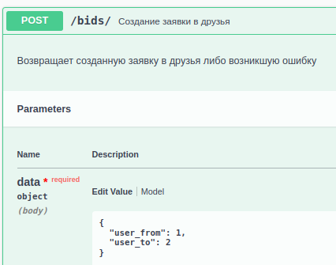
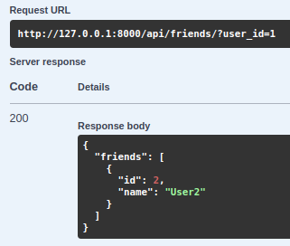

# Запуск проекта

## 1. Клонирование репозитория

Перейти в рабочу директорию и выполнить команду:

> git clone https://github.com/YaroslavIonin/vk_friends.git

И перейти в папку проекта 

> cd vk_friends/

## 2. Работа с docker compose

### 1) Создадим контейнер
> sudo docker compose build
### 2) Применим миграции
> docker compose run web api_friends/manage.py makemigrations api

> docker compose run web api_friends/manage.py migrate
### 3) Запустим
> docker compose up

# Работа с API

### 1. Начало
##### Откроем в браузере http://127.0.0.1:8000/swagger/

Видим интерфейс Swagger, в котором и будем работать

### 2. Регистрация пользователей
##### Регистрация пользователей доступна по адресу /api/register

Зарегистрируем двух пользователей: User1 и User2

### 3. Просмотр друзей
#### Просмотр друзей доступен по адресу /api/friends/

### 4. Отправление заявки в друзья
#### Отправление заявки в друзья доступно по адресу /api/bids/

Отправим заявку в друзья второму юзеру от первого

В ответе получаем объект созданной заявки со статусом 0 == Отправленная заявка

### 5. Просмотр исходящих/входящих заявок
#### Просмотр исходящих/входящих заявок доступен по адресу /api/bids/

Проверим исходящие заявки у первого юзера

Получим список исходящих заявок первого с только что отправленной заявкой

Проверив список входящих у первого, получим пустой список

Проверим входящие заявки у второго юзера
Получим список входящих заявок втрого с только что отправленной заявкой от первого

Проверив список исходщих у второго, получим пустой список

### 6. Принятие/отклонение заявки
#### Принятие/отклонение заявки доступно по адресу /api/bids/{id}

Допустим, что второй отклоняет заявку в друзья (status_do == 0, id == 1)

Исходящие и входящие заявки обоих юзеров не изменятся, 
изменится только статус заявки на 2 == Отклоненная заявка

Допустим, что второй принимает заявку в друзья (status_do == 1, id == 1)

Заявка исчезнет у первого из исходящих, у второго из входящих
Юзеры станут друзьями

### 7. Список друзей и статус дружбы
#### Список друзей доступен по адресу /api/friends/

Убедимся, что друзья появились у пользователей

У первого

У второго

#### Cтатус дружбы доступен по адресу /api/bids/check_status/

Проверим статус дружбы пользователей

### Удаление пользователя из друзей
#### Удаление пользователя из друзей доступно по адресу /api/friends/{id}

Допустим, 2 юзер удаляет первого

Проверяем статус дружбы

Для первого со вторым

Для второго с первым

Так же в исходящих/входящих появится созданная заявка от первого второму

Снова принимает заявку и предположим, что первый удаляет второго

Проверяем статус дружбы

Для первого со вторым

Для второго с первым

Так же в исходящих/входящих появится созданная заявка от второго первому (второй как будто попадает в подписчики)

### 8. Случай перекрёстных заявок

В данный момент у нас только одно заявка от второго первому
Пусть первый тоже отправит заявку второму

Получаем объект созданной заявки сразу со статусом 1 == Принятая заявка

Проверив исходящие/входящие заявки обоих юзеров, получис пустые списки, 
потому что обе созданные заявки принялись, и пользователи стали друзьями

Проверим статус дружбы

### 9. Удаление из друзей при перекрёстных заявках

На данный момент в системе две принятые заявки от первого второму и от второго первому

Допустим первый удаляет второго

В базе данных остаётся только заявка от второго первому с изменёным статусом на 0 == Отправленная заявка,
а пользователя удалятся друг друга из друзей

Проверим это в исходящих\входящих заявках

У второго появилась исходящая

У первого появилась входящая

В точности до наоборот будет, если второй удалит первого